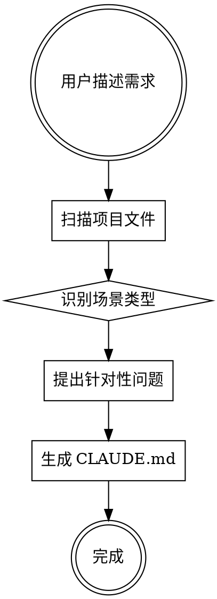

# CLAUDE.md 生成器

## 概述

通过对话式交互为各类工作场景生成定制化的 CLAUDE.md 文件。支持编程、数据分析、市场调研、内容创作等多种场景。

核心原则：**只包含项目需要的信息，不编造命令，保持精简。**

## 何时使用

**使用时机**:
- 新项目开始时，需要为 Claude Code 创建指导文档
- 用户明确说要生成或创建 CLAUDE.md 文件
- 项目缺少 CLAUDE.md，用户希望改善 Claude Code 的工作效果

**不使用时机**:
- 项目已有完善的 CLAUDE.md
- 用户只是询问 CLAUDE.md 是什么
- 用户要求更新现有 CLAUDE.md 的特定部分（直接编辑即可）

## 工作流程

### 流程图



### 三个阶段

1. **环境扫描**: 检查项目文件，提取实际信息
2. **交互澄清**: 根据场景提出 2-4 个问题
3. **生成文档**: 基于收集信息生成精简 CLAUDE.md

## 详细步骤

### 步骤 1: 扫描项目环境

**目标**: 了解项目现状，避免提无意义的问题

**操作**:
1. 使用 `Bash ls -la` 检查当前目录内容
2. 使用 `Glob` 查找关键文件:
   - 编程: `package.json`, `requirements.txt`, `go.mod`, `Cargo.toml`, `pom.xml`
   - 数据分析: `*.ipynb`, `*.py`, `*.R`, `data/`
   - 文档: `README.md`, `.cursorrules`
3. 如果找到配置文件，使用 `Read` 读取内容
4. 提取：
   - `package.json`: scripts, dependencies, name, description
   - `requirements.txt`: 依赖列表
   - `README.md`: 项目描述

**注意**:
- 不要扫描整个代码库，只读关键配置文件
- 空项目是正常的，不是错误

### 步骤 2: 识别场景并提问

**目标**: 通过提问理解用户的具体需求

**操作**:
1. 根据用户描述和扫描结果，判断场景类型
2. 使用 `AskUserQuestion` 工具一次性提出 2-4 个问题
3. 问题基于场景类型选择（见下方场景问题库）

**场景问题库**:

**编程项目**（已有 package.json 或用户明确说是编程）:
```json
{
  "questions": [
    {
      "question": "这个项目的主要类型是什么？",
      "header": "项目类型",
      "multiSelect": false,
      "options": [
        {"label": "前端应用", "description": "React/Vue/Angular 等前端框架"},
        {"label": "后端服务", "description": "API、微服务、服务器端应用"},
        {"label": "全栈应用", "description": "包含前后端的完整应用"},
        {"label": "CLI 工具", "description": "命令行工具或脚本"}
      ]
    },
    {
      "question": "主要开发任务是什么？",
      "header": "开发任务",
      "multiSelect": true,
      "options": [
        {"label": "新功能开发", "description": "添加新特性和功能"},
        {"label": "Bug 修复", "description": "修复现有问题"},
        {"label": "重构优化", "description": "改进代码结构和性能"},
        {"label": "测试编写", "description": "单元测试、集成测试"}
      ]
    }
  ]
}
```

**数据分析项目**（用户提到"分析"、"数据"）:
```json
{
  "questions": [
    {
      "question": "使用什么工具进行分析？",
      "header": "分析工具",
      "multiSelect": true,
      "options": [
        {"label": "Python (pandas/numpy)", "description": "使用 Python 数据分析库"},
        {"label": "Jupyter Notebook", "description": "交互式分析环境"},
        {"label": "R 语言", "description": "统计分析和可视化"},
        {"label": "SQL", "description": "数据库查询和分析"}
      ]
    },
    {
      "question": "数据存放在哪里？",
      "header": "数据位置",
      "multiSelect": false,
      "options": [
        {"label": "本地文件", "description": "CSV、Excel、JSON 等文件"},
        {"label": "数据库", "description": "MySQL、PostgreSQL、MongoDB 等"},
        {"label": "API 接口", "description": "从远程 API 获取数据"}
      ]
    }
  ]
}
```

**市场调研/竞品分析**（用户提到"调研"、"竞品"、"分析"）:
```json
{
  "questions": [
    {
      "question": "调研的主要对象是什么？",
      "header": "调研对象",
      "multiSelect": true,
      "options": [
        {"label": "竞品分析", "description": "分析竞争对手的产品和策略"},
        {"label": "市场趋势", "description": "研究行业发展趋势"},
        {"label": "用户需求", "description": "了解目标用户的需求和痛点"}
      ]
    },
    {
      "question": "主要使用什么分析框架？",
      "header": "分析框架",
      "multiSelect": false,
      "options": [
        {"label": "SWOT 分析", "description": "优势、劣势、机会、威胁"},
        {"label": "波特五力", "description": "行业竞争结构分析"},
        {"label": "用户画像", "description": "目标用户特征分析"}
      ]
    }
  ]
}
```

**内容创作**（用户提到"写作"、"文章"、"视频"、"内容"）:
```json
{
  "questions": [
    {
      "question": "创作什么类型的内容？",
      "header": "内容类型",
      "multiSelect": true,
      "options": [
        {"label": "技术文章", "description": "博客、教程、技术分析"},
        {"label": "视频脚本", "description": "视频内容的文字脚本"},
        {"label": "社交媒体", "description": "微博、公众号、小红书等"},
        {"label": "产品文档", "description": "用户手册、API 文档"}
      ]
    },
    {
      "question": "品牌调性是什么？",
      "header": "品牌调性",
      "multiSelect": false,
      "options": [
        {"label": "专业严谨", "description": "适合技术、B2B 内容"},
        {"label": "轻松活泼", "description": "适合消费类、娱乐内容"},
        {"label": "教育启发", "description": "适合教学、知识分享"}
      ]
    }
  ]
}
```

**智能判断逻辑**:
- 如果已有明确的 package.json 且 scripts 完整，只问开发任务
- 如果是空项目，先问场景类型，再问具体需求
- 如果用户描述已经很详细，减少问题数量

### 步骤 3: 生成 CLAUDE.md

**目标**: 基于收集的信息生成精简、实用的文档

**操作**:
1. 选择合适的模板（见下方模板库）
2. 替换模板中的占位符
3. 删除不相关的章节
4. 使用 `Write` 工具创建 CLAUDE.md

**重要原则**:
- ✅ 只包含从实际文件提取的命令
- ✅ 使用中文
- ✅ 保持精简
- ❌ 不编造命令
- ❌ 不包含通用建议
- ❌ 不添加未被要求的章节

### 步骤 4: 验证和完成

**操作**:
1. 输出生成的文件路径
2. 简要说明包含的内容（1-2 句话）
3. 提示用户可以随时修改

**示例输出**:
```
✓ CLAUDE.md 已生成: /path/to/project/CLAUDE.md

包含了开发环境配置和常用命令（dev、test、build、lint）。你可以随时修改或要求重新生成。
```

## 内容模板库

### 基础结构（所有场景）

```markdown
# CLAUDE.md

This file provides guidance to Claude Code (claude.ai/code) when working with code in this repository.

## 项目概述
[1-2句话描述项目目标]
```

### 编程项目模板

```markdown
## 开发环境
- 技术栈: [从实际依赖提取]
- 包管理器: [npm/yarn/pnpm/pip/cargo]

## 常用命令
[从 package.json scripts 或实际文件提取]
- 安装依赖: `[实际命令]`
- 开发模式: `[实际命令]`
- 运行测试: `[实际命令]`
- 构建项目: `[实际命令]`

## 架构说明
[仅在用户明确需要时添加]
```

**模板使用规则**:
- 从 package.json 的 `scripts` 字段提取命令
- 如果没有某个 script，不添加该行
- 技术栈从 `dependencies` 提取主要框架
- 空项目使用"待初始化"标注

### 数据分析项目模板

```markdown
## 分析环境
- 分析工具: [基于用户选择]
- 主要依赖: [从 requirements.txt 提取]

## 数据位置
- 原始数据: `data/raw/`
- 处理后数据: `data/processed/`
- 分析结果: `output/`

## 常用命令
- 安装依赖: `pip install -r requirements.txt`
- 启动 Jupyter: `jupyter notebook`
- 运行分析脚本: `python scripts/analyze.py`

## 分析流程
数据获取 → 清洗 → 分析 → 可视化 → 报告
```

### 市场调研模板

```markdown
## 调研目标
[基于用户描述的1句话]

## 信息来源
- 竞品网站: [用户提供或标注"待补充"]
- 行业报告: [用户提供或标注"待补充"]

## 分析框架
[用户选择的框架: SWOT/波特五力/用户画像]

## 输出规范
- 报告格式: Markdown
- 存放位置: `reports/`
- 命名规范: YYYY-MM-DD-主题
```

### 内容创作模板

```markdown
## 内容类型
[基于用户选择]

## 品牌调性
[用户选择的调性]

## 内容规范
- 目标受众: [基于用户描述]
- 核心信息: [用户要传达的内容]

## 素材管理
- 图片库: `assets/images/`
- 参考资料: `references/`
- 模板: `templates/`

## 发布流程
创作 → 审阅 → 编辑 → 发布
```

## 边界情况处理

### 已存在 CLAUDE.md

使用 `Glob` 检查是否存在 CLAUDE.md：
```bash
if [ -f "CLAUDE.md" ]; then
  # 询问用户是否覆盖
fi
```

提示用户：
```
检测到已存在 CLAUDE.md 文件。是否要覆盖？
- 覆盖：删除现有文件，生成新的
- 取消：保留现有文件，不生成
```

### 空项目

如果扫描发现目录为空：
- 仍然生成 CLAUDE.md
- 在相关章节标注"待初始化"
- 提供通用命令格式（不是具体命令）

示例：
```markdown
## 常用命令
待项目初始化后添加具体命令
```

### 混合项目（全栈）

如果检测到前后端都存在（如 package.json + requirements.txt）：
- 合并两个模板的相关部分
- 分别列出前端和后端命令
- 使用子标题区分

示例：
```markdown
## 开发环境

### 前端
- 技术栈: React
- 包管理器: npm

### 后端
- 技术栈: Python Flask
- 包管理器: pip

## 常用命令

### 前端
- 开发: `npm run dev`

### 后端
- 启动: `python app.py`
```

## 常见错误

### ❌ 错误 1: 编造命令

**问题**: 添加了项目中不存在的命令
```markdown
## 常用命令
- 运行测试: `npm test`  # 但 package.json 中没有 test script
```

**解决**: 只包含实际存在的 scripts
```markdown
## 常用命令
- 开发模式: `npm run dev`
- 构建项目: `npm run build`
# 没有 test script，就不添加
```

### ❌ 错误 2: 包含通用建议

**问题**: 添加了与项目无关的通用内容
```markdown
## 开发规范
- 写清晰的注释
- 遵循代码规范
- 做好单元测试
```

**解决**: 不添加这些通用内容，保持精简

### ❌ 错误 3: 过度详细

**问题**: 列出所有文件结构和每个组件
```markdown
## 项目结构
- src/
  - components/
    - Button.tsx
    - Input.tsx
    - ...（50个文件）
```

**解决**: 只包含"需要多文件才能理解的"架构信息

### ❌ 错误 4: 重复生成

**问题**: 为已有完善 CLAUDE.md 的项目重新生成

**解决**: 先检查是否存在，询问用户是否覆盖

## 完整示例

### 示例 1: React 项目

**用户输入**: "我要开发一个 React 管理后台，主要做增删改查功能，请生成 CLAUDE.md"

**步骤 1: 扫描项目**
```bash
# 找到 package.json
# 读取内容，发现:
# - scripts: dev, build, test, lint
# - dependencies: react, react-dom, antd
```

**步骤 2: 提问**
使用 AskUserQuestion 询问：
1. 项目类型：前端应用
2. 开发任务：新功能开发、测试编写

**步骤 3: 生成 CLAUDE.md**
```markdown
# CLAUDE.md

This file provides guidance to Claude Code (claude.ai/code) when working with code in this repository.

## 项目概述
React 管理后台，用于用户和产品的增删改查功能。

## 开发环境
- 技术栈: React 18, Ant Design
- 包管理器: npm

## 常用命令
- 安装依赖: `npm install`
- 开发模式: `npm run dev`
- 运行测试: `npm test`
- 构建项目: `npm run build`
- 代码检查: `npm run lint`
```

### 示例 2: 数据分析项目（空目录）

**用户输入**: "我要用 Python 分析销售数据，做可视化报表"

**步骤 1: 扫描项目**
```bash
# 空目录，没有文件
```

**步骤 2: 提问**
1. 分析工具：Python (pandas/numpy), Jupyter Notebook
2. 数据位置：本地文件

**步骤 3: 生成 CLAUDE.md**
```markdown
# CLAUDE.md

This file provides guidance to Claude Code (claude.ai/code) when working with code in this repository.

## 项目概述
使用 Python 进行销售数据分析和可视化报表生成。

## 分析环境
- 分析工具: Python (pandas, numpy, matplotlib), Jupyter Notebook
- 主要依赖: 待创建 requirements.txt

## 数据位置
- 原始数据: `data/raw/`
- 处理后数据: `data/processed/`
- 分析结果: `output/`

## 常用命令
待项目初始化后添加具体命令。

建议命令:
- 安装依赖: `pip install -r requirements.txt`
- 启动 Jupyter: `jupyter notebook`

## 分析流程
数据获取 → 清洗 → 分析 → 可视化 → 报告
```
